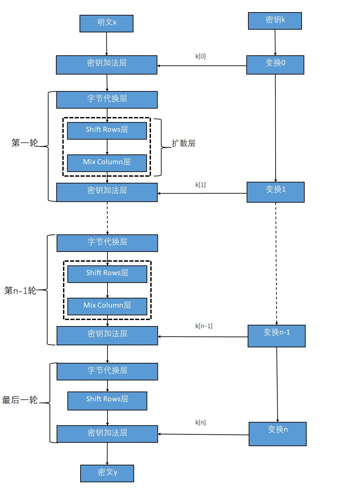

使用Matlab实现AES加密算法

AES的全称是Advanced Encryption Standard，意思是高级加密标准。它的出现主要是为了取代DES加密算法的，因为我们都知道DES算法的密钥长度是56Bit，因此算法的理论安全强度是2的56次方。但二十世纪中后期正是计算机飞速发展的阶段，元器件制造工艺的进步使得计算机的处理能力越来越强，虽然出现了3DES的加密方法，但由于它的加密时间是DES算法的3倍多，64Bit的分组大小相对较小，所以还是不能满足人们对安全性的要求。于是1997年1月2号，美国国家标准技术研究所宣布希望征集高级加密标准，用以取代DES。AES也得到了全世界很多密码工作者的响应，先后有很多人提交了自己设计的算法。最终有5个候选算法进入最后一轮：Rijndael，Serpent，Twofish，RC6和MARS。最终经过安全性分析、软硬件性能评估等严格的步骤，Rijndael算法获胜。

**AES算法主要有四种操作处理，分别是密钥加法层(也叫轮密钥加，英文Add Round Key)、字节代换层(SubByte)、行位移层(Shift Rows)、列混淆层(Mix Column)。** AES加密算法流程如下：

